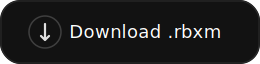
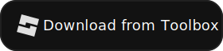

# 🔩 Weldify

**Weldify** is a powerful drop-in welding solution for Roblox models.  
Just insert the script into any model, and it handles everything automatically.

## ✨ Features

- 🔧 Cleans up old welds (`Weld` and `Motor6D`)
- 🧲 Auto-uses `Motor6D` for characters, `Weld` otherwise
- 📌 Temporarily anchors all parts during welding
- 🚀 Unanchors the model after welding is done

## 🛠️ Usage

**Drag and drop** the script into any model you want welded.  
No configuration, no function calls. It just works.

  <!-- Левая кнопка -->
  
  
  <!-- Правая кнопка -->
  

## 💥 Smart Behavior

- Detects if the model is a character (via `Humanoid`)
- Uses `PrimaryPart` if available, otherwise falls back to the first part
- Ignores root part for welding to itself
- Automatically unanchors the model after it's ready

## 📜 License

MIT – use, remix, modify, rule the world 🧪

